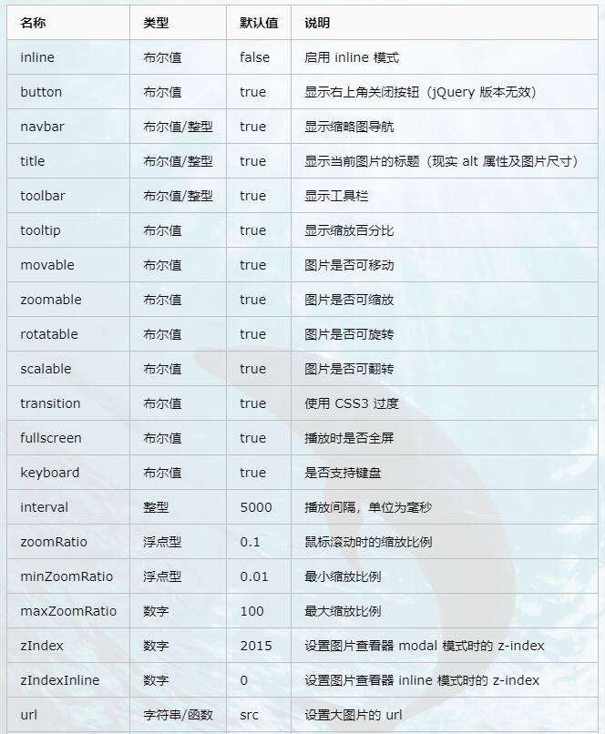

# 简介
> Viewer.js 是一款强大的图片查看器  
> Viewer.js 特点：
>> 1. 支持移动设备触摸事件  
>> 2. 支持响应式  
>> 3. 支持放大/缩小  
>> 4. 支持旋转（类似于微博的图片旋转）  
>> 5. 支持水平/垂直翻转  
>> 6. 支持图片移动  
>> 7. 支持键盘  
>> 8. 支持全屏幻灯片模式  
>> 9. 支持缩略图  
>> 10. 支持标题显示  
>> 11. 支持多种自定义事件  

### viewer 函数参数说明

#### viewer 函数其他类型参数说明
| 名称 | 类型 | 默认值 | 说明 |  
| --- | --- | --- | --- |
| build | 函数 | null | 回调函数，viewer.js文件加载完成后调用 |
| built | 函数 | null | 回调函数，viewer函数初始化之前调用（只调用一次） |
| show | 函数 | null | 回调函数，加载展示图层前调用 |
| shown | 函数 | null | 回调函数，加载展示图层完成后调用 |
| hide | 函数 | null | 回调函数，点击关闭展示按钮时调用 |
| hidden | 函数 | null | 回调函数，展示图层关闭前调用 |
| view | 函数 | null | 回调函数，加载展示图片前调用 |
| viewed | 函数 | null | 回调函数，展示图片加载完成时调用 |

### 链接
> 演示地址：http://www.dowebok.com/demo/192/index2.html   
> 博客：https://www.cnblogs.com/Jimc/p/10132177.html  

### 提示
> demoPage 里面是一个完整的ViewerJS的演示实例  